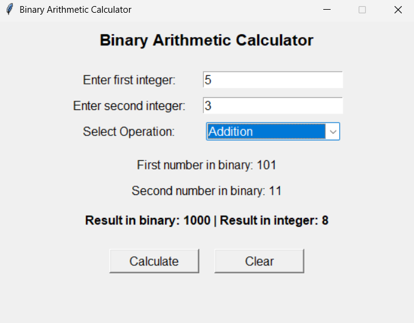
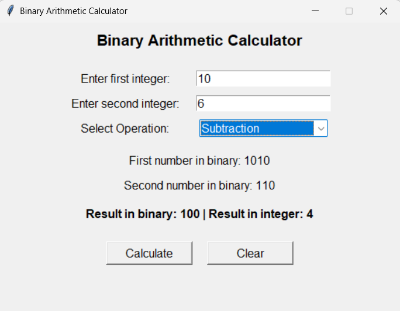
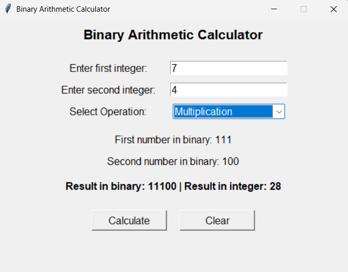
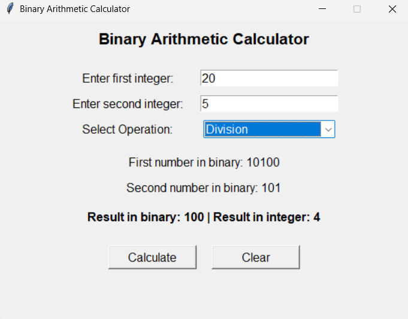
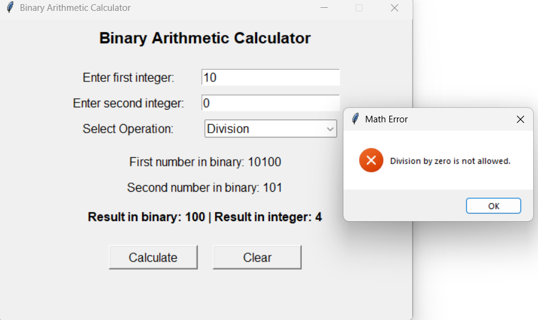

# Binary Arithmetic Calculator (Tkinter)

A simple Python GUI application that performs **Binary Addition, Subtraction, Multiplication, and Division**.  
Built using **Tkinter** with clean UI and real-time binary conversion.

---

## 🚀 Features
- Convert both input integers to binary
- Perform:
  - Addition
  - Subtraction
  - Multiplication
  - Integer Division
- Display result in:
  - Binary format
  - Decimal format
- Error handling (invalid input, division by zero)
- Simple and interactive Tkinter interface

---

## 🖼️ Output Screenshots

### Addition Example

### Subtraction Example

### Multiplication Example

### Division Example 

### Division Error Handling

